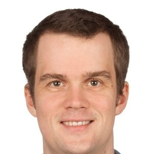
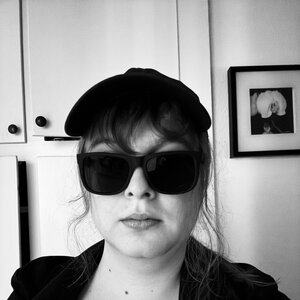

::: {.hero}

::: {.hero-top}
[← Back to RSE-hackathon](index.html){.back-link}

# Organizers
:::

::: {.hero-body}
## Charité

::: {.contact-card}
**Magnus Hagdorn** [he/him]{.pronouns}\
Program Chair\
[magnus.hagdorn@charite.de](mailto:magnus.hagdorn@charite.de)
:::

## Gesellschaft für Informatik

::: {.contact-card .has-photo}

**Julian Dehne** [he/him]{.pronouns}\
Event Organizer, Program Chair\
[julian.dehne@gi.de](mailto:julian.dehne@gi.de)\
[juliandehne.github.io](https://juliandehne.github.io)\
[GitHub](https://github.com/juliandehne)
:::

::: {.contact-card}
**Fabian Lochner** [he/him]{.pronouns}\
Outreach and Marketing Officer, Travel Organization\
[fabian.lochner@gi.de](mailto:fabian.lochner@gi.de)\
[GitHub](https://github.com/FabiLochner)
:::

## University of Copenhagen

::: {.contact-card .has-photo}

**Helene S. Holst** [she/her]{.pronouns}\
Technical Chair, Outreach and Marketing Officer\
[hel@personalhel.com](mailto:hel@personalhel.com)\
[personalhel.com](https://personalhel.com)\
[Codeberg](https://codeberg.org/personalhel) · [GitHub](https://github.com/personalhel)
:::

## University of Glasgow

::: {.contact-card}
**Bernhard Reinsberg** [he/him]{.pronouns}\
Event Organizer\
[Bernhard.Reinsberg@glasgow.ac.uk](mailto:Bernhard.Reinsberg@glasgow.ac.uk)
:::

::: {.contact-card}
**Jessica Brackenridge** [she/her]{.pronouns}\
Event Organizer\
[Jessica.Brackenridge@glasgow.ac.uk](mailto:Jessica.Brackenridge@glasgow.ac.uk)
:::

:::

:::

<button id="theme-toggle" class="theme-toggle" aria-label="Toggle light and dark mode"></button>

