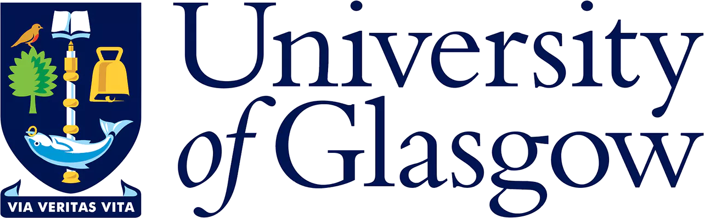

::: {.hero}
[Glasgow · 27–28 November 2026]{.eyebrow}

# RSE Hackathon 2026

Two days of building research software enginnering tools in **Glasgow**.\

[Register on Eventbrite](https://www.eventbrite.com/e/REPLACE-WITH-YOUR-EVENT-LINK){.cta target="_blank"}

  

:::

<button id="theme-toggle" class="theme-toggle" aria-label="Toggle light and dark mode">☀ Light mode</button>

